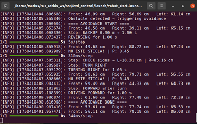
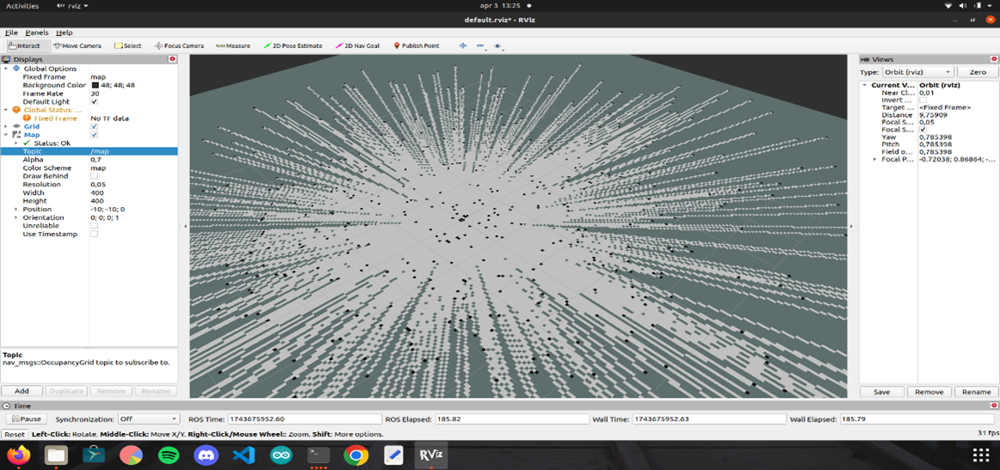

# Autonomous Robot for Bottle Detection using ROS

This project demonstrates a mobile robot capable of autonomous navigation and plastic bottle detection using ROS (Robot Operating System). It integrates multiple subsystems including proximity sensing, deep learning-based object recognition, obstacle avoidance, and real-time decision-making.

---

## 🧠 Project Features

- **Obstacle Detection** using ultrasonic sensors (front, left, right).
- **Bottle Detection** using a trained neural network model.
- **Autonomous Navigation** with direction selection when obstacle avoidance is triggered.
- **RViz Integration** for real-time sensor data and robot perception.
- **Probability Feedback** for detection confidence.

---

## 🖥️ System Overview

The robot constantly reads distances from three ultrasonic sensors. Based on this data:

- If an object is close, the robot stops and enters an **avoidance routine**, selecting the best direction.
- If a plastic bottle is detected, it displays a message and the **confidence level** (e.g. `P: 0.67`).
- Movement is controlled based on the closest free path.

### Real-Time Visualizations

#### Sensor Data and Navigation Prediction (Example Output)


#### RViz View of Laser Scan / Obstacle Detection using LIDAR


---

## 📂 Project Structure

```bash
Autonomous-Robot-Bottle-Detection-ROS/
├── launch/                     # ROS launch files
├── src/
│   ├── robot_controller/       # ROS node for robot control
│   ├── bottle_detector/        # Neural network and image classification node
│   └── proximity_sensors/      # Sensor reading and publishing
├── models/                     # Pretrained model(s) for bottle detection
├── rviz/                       # RViz config
├── scripts/                    # Utility or helper scripts
├── README.md                   # This file
```

---

## ⚙️ Requirements

- ROS Noetic (tested on Ubuntu 20.04)
- Python 3.8+
- Packages:
  - `rospy`
  - `sensor_msgs`
  - `cv_bridge`, `OpenCV`
  - `Tensorflow` (for neural network inference)

---

## 🚀 How to Run

1. **Clone the repository:**
   ```bash
   git clone https://github.com/marius2347/Autonomous-Robot-Bottle-Detection-ROS.git
   cd Autonomous-Robot-Bottle-Detection-ROS
   ```

2. **Build the workspace:**
   ```bash
   catkin_make
   source devel/setup.bash
   ```

3. **Run the robot launch file:**
   ```bash
   roslaunch robot_start.launch
   ```

---

## 📧 Contact

For questions, suggestions, or collaborations:

**📩 Email:** [mariusc0023@gmail.com](mailto:mariusc0023@gmail.com)

---

## 📌 Example Terminal Output

```
[INFO]: DRIVING FORWARD for 1.0 s
[INFO]: Front: 61.60 cm  Right: 77.48 cm  Left: 72.39 cm
[INFO]: ==== AVOIDANCE DONE ====
[INFO]: Front: 53.61 cm  Right: 77.74 cm  Left: 85.53 cm
[INFO]: ESTE STICLA! | P: 0.67
```

---

## 🛠️ Future Improvements

- Add collection mechanism once a bottle is detected.
- Implement advanced object tracking and bounding boxes in real-time.
